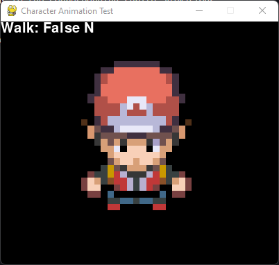

# ByteCrisis Character Animation Module



> A module for handling character animation in the ByteCrisis game.

This repository contains a specialized character animation module for the ByteCrisis project, a thrilling 2D action game. The module provides a flexible and efficient solution for managing character animations based on player input.

## Folder Structure

- **demo**: Contains sample sprite images and a JSON file for character animation.
- **character.py**: Defines the `CharacterSprite` class for loading and rendering character sprites.
- **demo.py**: Runs a sample demonstration of the character animation.

## Usage

The ByteCrisis Character Animation Module offers a comprehensive set of features for handling character animations in your game. It provides the following capabilities:

- Loading character sprites from sprite sheets or individual images.
- Mapping different actions (idle, walk, etc.) and directions to the corresponding sprite animations.
- Smooth transitions between different animation frames.
- Support for customizing sprite dimensions and scaling.
- Efficient rendering of character sprites for optimal performance.

## Demo Customization

The demo script `demo.py` can be customized to load different sprites and animations. The following steps describe how to customize the demo:

1. Create a new folder in the `demo` directory and name it after your character.
2. Add the sprite images for your character to the new folder.
3. Create a JSON file in the new folder and name it after your character.
4. Edit the JSON file to define the animations for your character.
5. Edit the `demo.py` script to load your character's sprites and animations.
6. Run the `demo.py` script to see your character in action!

## JSON Animation File

The JSON file for defining character animations is structured as follows:

```json
    "idle_{direction}": [
        "path/to/sprite1",
        "path/to/sprite2",
        ...
    ],
    "walk_{direction}": [
        "path/to/sprite1",
        "path/to/sprite2",
        ...
    ],
```

## TODO
```
- [ ] Add support for loading animations from sprite sheets.
- [ ] Add support for custom animation actions.
```
